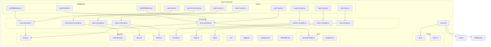

```mermaid

 flowchart TD
  %% Root Directory
  subgraph sports-backend/
    direction TB

    subgraph config/
      db[db.js]
      roles[roles.js]
    end

    subgraph middleware/
      authMW[authMiddleware.js]
      roleMW[roleMiddleware.js]
      errorHandler[errorHandler.js]
    end

    subgraph utils/
      token[generateToken.js]
      validators[validators.js]
    end

    subgraph models/
      User[User.js]
      Tournament[Tournament.js]
      Sport[Sport.js]
      Match[Match.js]
      Auction[Auction.js]
      Team[Team.js]
      Bid[Bid.js]
    end

    subgraph controllers/
      authC[auth.controller.js]
      userC[user.controller.js]
      tournamentC[tournament.controller.js]
      sportC[sport.controller.js]
      matchC[match.controller.js]
      auctionC[auction.controller.js]
      teamC[team.controller.js]
      bidC[bid.controller.js]
    end

    subgraph routes/
      authR[auth.routes.js]
      userR[user.routes.js]
      tournamentR[tournament.routes.js]
      sportR[sport.routes.js]
      matchR[match.routes.js]
      auctionR[auction.routes.js]
      teamR[team.routes.js]
      bidR[bid.routes.js]
    end

    env[.env]
    git[.gitignore]
    server[server.js]
    pkg[package.json]
    readme[README.md]

  end

  %% Logical Connections
  authR --> authC --> User
  userR --> userC --> User
  tournamentR --> tournamentC --> Tournament
  sportR --> sportC --> Sport
  matchR --> matchC --> Match
  auctionR --> auctionC --> Auction
  teamR --> teamC --> Team
  bidR --> bidC --> Bid

  authC --> token
  authMW --> authC
  roleMW --> userC
  errorHandler --> authC

  server --> db
  server --> routes
  server --> middleware

```
