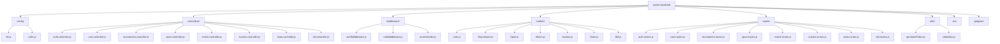

```mermaid
graph TD
  A[sports-backend/] --> A1[config/]
  A1 --> A1a[db.js]
  A1 --> A1b[roles.js]

  A --> A2[controllers/]
  A2 --> A2a[auth.controller.js]
  A2 --> A2b[user.controller.js]
  A2 --> A2c[tournament.controller.js]
  A2 --> A2d[sport.controller.js]
  A2 --> A2e[match.controller.js]
  A2 --> A2f[auction.controller.js]
  A2 --> A2g[team.controller.js]
  A2 --> A2h[bid.controller.js]

  A --> A3[middleware/]
  A3 --> A3a[authMiddleware.js]
  A3 --> A3b[roleMiddleware.js]
  A3 --> A3c[errorHandler.js]

  A --> A4[models/]
  A4 --> A4a[User.js]
  A4 --> A4b[Tournament.js]
  A4 --> A4c[Sport.js]
  A4 --> A4d[Match.js]
  A4 --> A4e[Auction.js]
  A4 --> A4f[Team.js]
  A4 --> A4g[Bid.js]

  A --> A5[routes/]
  A5 --> A5a[auth.routes.js]
  A5 --> A5b[user.routes.js]
  A5 --> A5c[tournament.routes.js]
  A5 --> A5d[sport.routes.js]
  A5 --> A5e[match.routes.js]
  A5 --> A5f[auction.routes.js]
  A5 --> A5g[team.routes.js]
  A5 --> A5h[bid.routes.js]

  A --> A6[utils/]
  A6 --> A6a[generateToken.js]
  A6 --> A6b[validators.js]

  A --> A7[.env]
  A --> A8[.gitignore]
```
  A --> A9[server.js]
  A --> A10[package.json]
  A --> A11[README.md]
